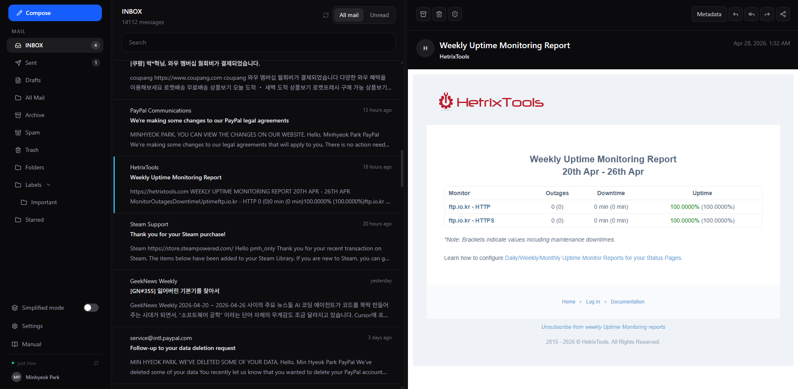
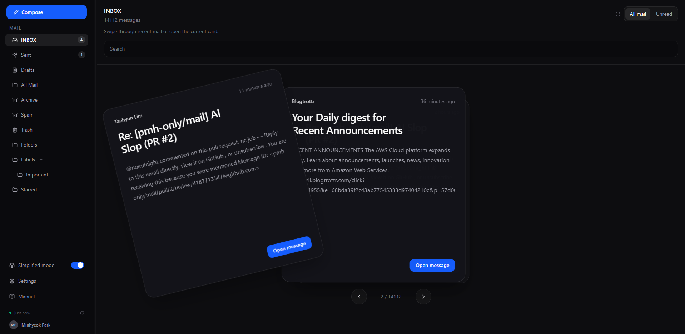
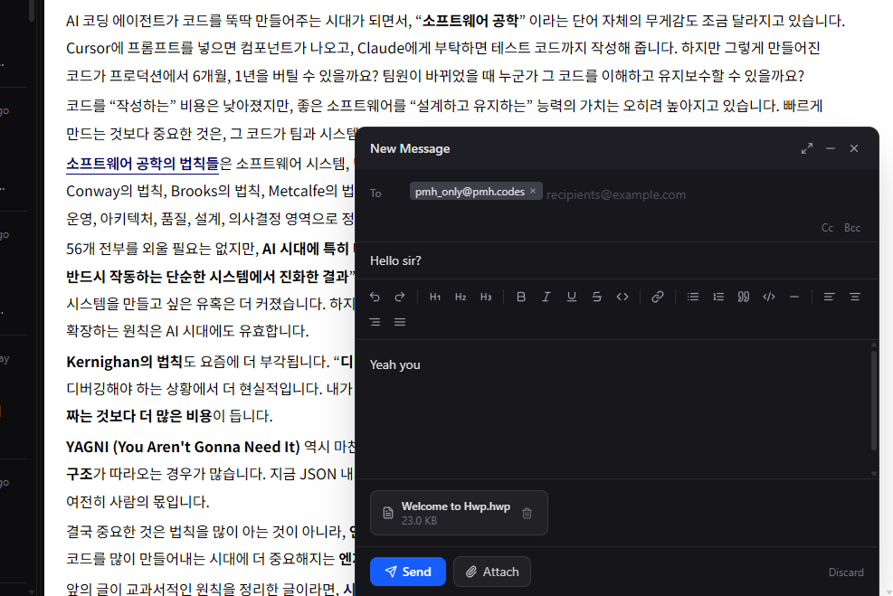
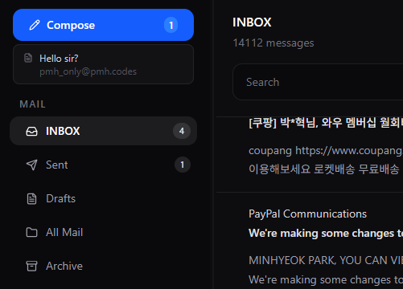

# ✉️ mail

<!-- ALL-CONTRIBUTORS-BADGE:START - Do not remove or modify this section -->

[](#contributors-)

<!-- ALL-CONTRIBUTORS-BADGE:END -->

The next webmail client

## Screenshots

> Click to zoom in






## Focused on

- Single user only
- Primary OIDC support
- Simple and Modern design
- Fast, SSR-first

## Inspired by

- [Proton Mail](https://proton.me/mail)
- [Bulwark](https://bulwarkmail.org/)
- [shadcn/ui](https://v3.shadcn.com/examples/mail)

## How to run

> You need running PostgreSQL instance.

1. Clone this repository
2. Copy `.env.example` to `.env` and replace placeholders
3. Run `pnpm i` to download dependencies
4. Run `pnpm dev` to start

## How to deploy

You can use prebuilt container image for deployment.

```sh
docker -itp 3000:3000 --env-file=.env \
  ghcr.io/pmh-only/mail:latest
```

`.env` template is [here](./.env.example)

## Contributors

<!-- ALL-CONTRIBUTORS-LIST:START - Do not remove or modify this section -->
<!-- prettier-ignore-start -->
<!-- markdownlint-disable -->
<table>
  <tbody>
    <tr>
      <td align="center" valign="top" width="14.28%"><a href="https://lth.so"><br /><sub><b>Taehyun Lim</b></sub></a><br /><a href="https://github.com/pmh-only/mail/commits?author=noeulnight" title="Code">💻</a></td>
    </tr>
  </tbody>
</table>

<!-- markdownlint-restore -->
<!-- prettier-ignore-end -->

<!-- ALL-CONTRIBUTORS-LIST:END -->

## License / Contribution Rules

This is a copyleft software. and there's no rules for contribution.
