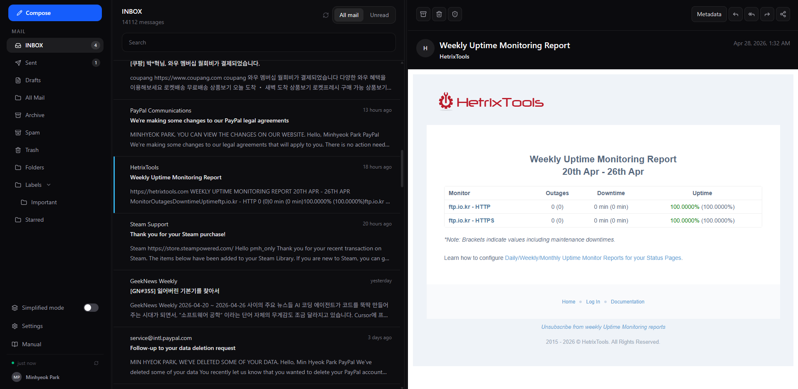
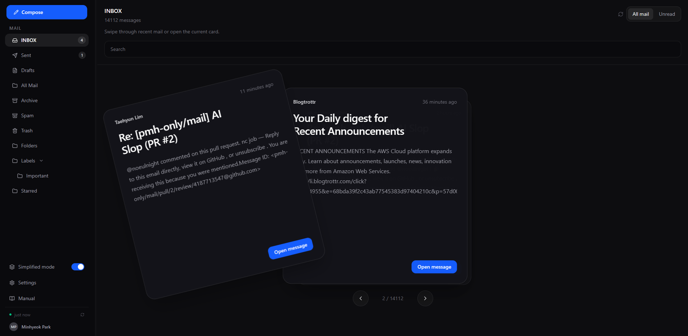
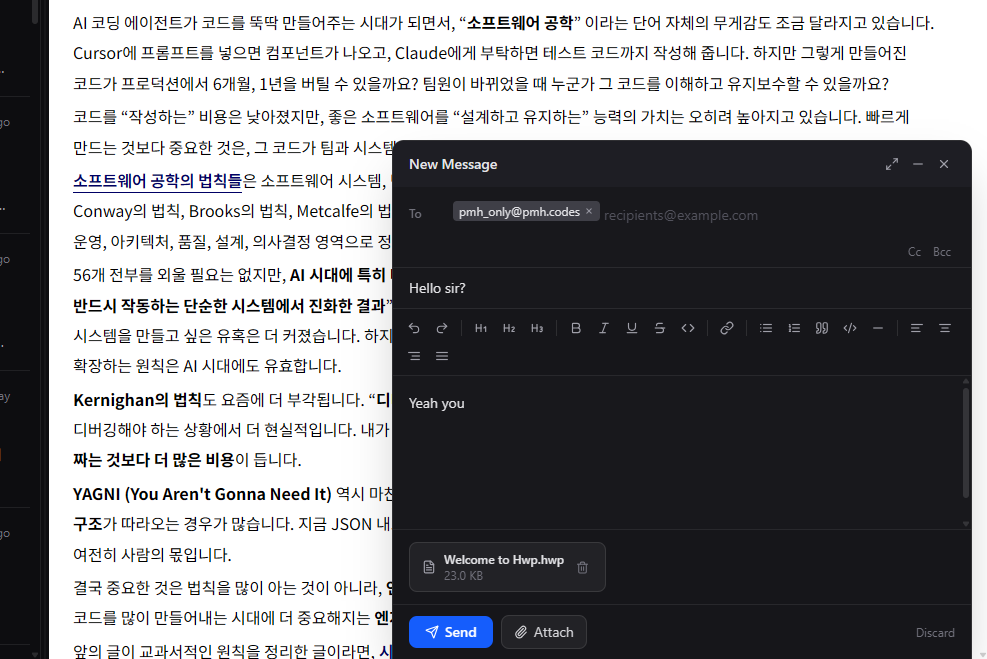
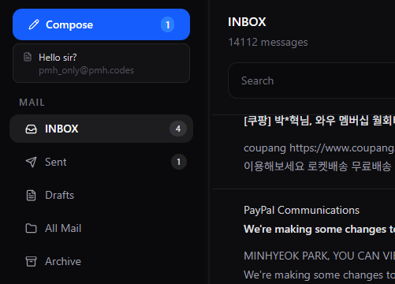

# ✉️ mail

<!-- ALL-CONTRIBUTORS-BADGE:START - Do not remove or modify this section -->
[](#contributors-)
<!-- ALL-CONTRIBUTORS-BADGE:END -->

The next webmail client

## Live demo

Try it now: https://maildemo.pmh.codes/

The demo runs with preloaded data and resets automatically, so you can explore the full UI without configuring PostgreSQL, mail servers, or authentication.

## Screenshots

> Click to zoom in






## Focused on

- Single user only
- Password, passkey, GitHub, Discord, and OpenID Connect authentication
- OpenPGP cleartext, detached, and PGP/MIME signing, encryption, verification, and decryption
- Simple and Modern design
- Fast, SSR-first

## Inspired by

- [Proton Mail](https://proton.me/mail)
- [Bulwark](https://bulwarkmail.org/)
- [shadcn/ui](https://v3.shadcn.com/examples/mail)

## How to run

> You need running PostgreSQL instance.

Want to try it first without local setup? Use the live demo: https://maildemo.pmh.codes/

1. Clone this repository
2. Copy `.env.example` to `.env` and replace placeholders
3. Run `pnpm i` to download dependencies
4. Run `pnpm dev` to start

## Environment variables

Copy `.env.example` to `.env` for the web process. `pnpm dev` also loads that file for
the worker. For separate deployments, provide the same database, encryption, AI, and
mail-authentication values to both processes; `.env.example.worker` is a worker-focused
template.

Values saved through the setup or settings UI take precedence over the corresponding
authentication, AI, IMAP, and SMTP environment variables. An empty default below means
the feature is disabled or must be configured in the UI. Boolean mail settings are enabled
by any non-empty value except `false`.

### Core and database

| Variable                     | Description                                                                                                                                                                                                                                                        | Default | Example                                  |
| ---------------------------- | ------------------------------------------------------------------------------------------------------------------------------------------------------------------------------------------------------------------------------------------------------------------ | ------- | ---------------------------------------- |
| `DATABASE_URL`               | PostgreSQL connection URL shared by the web and worker processes. Required unless `DEMO_MODE` is enabled.                                                                                                                                                          | none    | `postgresql://mail:secret@db:5432/mail`  |
| `PG_POOL_MAX`                | Maximum PostgreSQL connections per process.                                                                                                                                                                                                                        | `10`    | `20`                                     |
| `PG_TLS_REJECT_UNAUTHORIZED` | Set to `false` only to accept a private or self-signed PostgreSQL certificate. It does not affect OAuth or mail-server TLS.                                                                                                                                        | `true`  | `false`                                  |
| `ORIGIN`                     | Public, scheme-qualified web origin used by authentication, callbacks, passkeys, and outgoing email read tracking. Required by both web and worker processes outside demo mode and must match the browser's Origin header.                                         | none    | `https://mail.example.com`               |
| `BETTER_AUTH_SECRET`         | High-entropy Better Auth signing secret. Use at least 32 characters in production.                                                                                                                                                                                 | none    | `replace-with-a-long-random-value`       |
| `MAIL_SECRET_KEY`            | High-entropy key used to encrypt OpenPGP private keys, mail passwords, provider secrets, and the OpenAI key stored in PostgreSQL. It is required for OpenPGP private-key import/generation, must be identical in web and worker processes, and must remain stable. | empty   | `replace-with-another-long-random-value` |
| `DEMO_MODE`                  | Runs with in-memory sample data and disables live database, mail, authentication, and worker requirements. Accepted true values are `1`, `true`, `yes`, and `on`.                                                                                                  | `false` | `true`                                   |

### Web runtime

These settings apply to `node server.js` and the prebuilt web container.

| Variable                | Description                                                                                                                                     | Default                        | Example                 |
| ----------------------- | ----------------------------------------------------------------------------------------------------------------------------------------------- | ------------------------------ | ----------------------- |
| `HOST`                  | Address on which the HTTP server listens.                                                                                                       | `0.0.0.0`                      | `127.0.0.1`             |
| `PORT`                  | HTTP server port.                                                                                                                               | `3000`                         | `8080`                  |
| `BODY_SIZE_LIMIT`       | Maximum request-body size accepted by the SvelteKit handler. Use `Infinity` for no limit, or a number with an optional `K`, `M`, or `G` suffix. | `Infinity`                     | `32M`                   |
| `PUBLIC_ATTACHMENT_DIR` | Persistent file storage for public-link attachments. Back it up with PostgreSQL and use shared storage when running multiple web instances.     | `data/public-attachments`      | `/srv/mail/attachments` |
| `NODE_ENV`              | Set to `production` to disable development performance logs. The runtime Docker image sets this automatically.                                  | unset (`production` in Docker) | `production`            |

Public-link uploads can be as large as 1 GiB. Configure every reverse proxy in front of the web
process to accept request bodies of at least that size. Docker Compose uses a named volume at
`/app/data/public-attachments` regardless of the host `.env` value.

### Authentication providers

Provider values can instead be entered in setup or Settings. Register the callback URLs
listed in [Authentication](#authentication).

| Variable                 | Description                                                                                                             | Default | Example                                                   |
| ------------------------ | ----------------------------------------------------------------------------------------------------------------------- | ------- | --------------------------------------------------------- |
| `GITHUB_CLIENT_ID`       | GitHub OAuth application client ID.                                                                                     | empty   | `Ov23liExample`                                           |
| `GITHUB_CLIENT_SECRET`   | GitHub OAuth application client secret.                                                                                 | empty   | `github-client-secret`                                    |
| `DISCORD_CLIENT_ID`      | Discord OAuth application client ID.                                                                                    | empty   | `123456789012345678`                                      |
| `DISCORD_CLIENT_SECRET`  | Discord OAuth application client secret.                                                                                | empty   | `discord-client-secret`                                   |
| `OIDC_ISSUER`            | OIDC issuer identifier. All four endpoint variables below must be supplied for manual OIDC configuration.               | empty   | `https://id.example.com`                                  |
| `OIDC_AUTHORIZATION_URL` | OIDC authorization endpoint.                                                                                            | empty   | `https://id.example.com/oauth2/authorize`                 |
| `OIDC_TOKEN_URL`         | OIDC token endpoint.                                                                                                    | empty   | `https://id.example.com/oauth2/token`                     |
| `OIDC_USER_INFO_URL`     | OIDC user-info endpoint.                                                                                                | empty   | `https://id.example.com/oauth2/userinfo`                  |
| `OIDC_CLIENT_ID`         | OIDC client ID.                                                                                                         | empty   | `mail-web`                                                |
| `OIDC_CLIENT_SECRET`     | OIDC client secret.                                                                                                     | empty   | `oidc-client-secret`                                      |
| `OIDC_DISCOVERY_URL`     | Deprecated discovery-document fallback for existing installations. Use the four manual OIDC values for new deployments. | empty   | `https://id.example.com/.well-known/openid-configuration` |

### AI and mail authentication

| Variable                           | Description                                                                                                                                                           | Default        | Example                       |
| ---------------------------------- | --------------------------------------------------------------------------------------------------------------------------------------------------------------------- | -------------- | ----------------------------- |
| `OPENAI_API_KEY`                   | OpenAI API key for AI features.                                                                                                                                       | empty          | `sk-proj-example`             |
| `OPENAI_MODEL`                     | OpenAI model used for AI operations.                                                                                                                                  | `gpt-4.1-mini` | `gpt-4.1-mini`                |
| `OPENAI_IMPORTANCE_CLASSIFICATION` | Automatically sends incoming mail to the configured model for importance classification. Set to `false` to retain other AI features without automatic classification. | `true`         | `false`                       |
| `MAIL_AUTH_TRUSTED_AUTHSERV_IDS`   | Comma-separated trusted Authentication-Results `authserv-id` values. A leading `*.` matches subdomains. Use the same value in web and worker processes.               | empty          | `mx.example.com,*.google.com` |

### IMAP

The legacy single-server variables create the `primary` account when host, user, and
password are all present. Settings stored in PostgreSQL take precedence. `IMAP_SERVERS`
adds more accounts after the primary account.

| Variable                         | Description                                                                                                       | Default | Example             |
| -------------------------------- | ----------------------------------------------------------------------------------------------------------------- | ------- | ------------------- |
| `IMAP_HOST`                      | Primary IMAP server hostname.                                                                                     | empty   | `imap.example.com`  |
| `IMAP_PORT`                      | Primary IMAP server port.                                                                                         | `993`   | `993`               |
| `IMAP_SECURE`                    | Uses implicit TLS for the primary IMAP connection.                                                                | `true`  | `true`              |
| `IMAP_ALLOW_INVALID_CERTIFICATE` | Disables TLS certificate verification for the primary IMAP server. Enable only for a trusted private server.      | `false` | `false`             |
| `IMAP_USER`                      | Primary IMAP login.                                                                                               | empty   | `alice@example.com` |
| `IMAP_PASSWORD`                  | Primary IMAP password.                                                                                            | empty   | `imap-password`     |
| `IMAP_MAILBOX`                   | Mailbox selected for the primary account.                                                                         | `INBOX` | `INBOX`             |
| `IMAP_POLL_SECONDS`              | Poll interval for the primary account, in seconds.                                                                | `15`    | `30`                |
| `IMAP_SERVERS`                   | JSON array of additional IMAP accounts. Invalid JSON is ignored. Per-account defaults match the primary defaults. | `[]`    | See below           |

```env
IMAP_SERVERS='[{"id":"archive","name":"Archive","host":"imap.example.net","port":993,"secure":true,"allowInvalidCertificate":false,"user":"archive@example.net","password":"secret","mailbox":"INBOX","pollSeconds":30}]'
```

### SMTP

The legacy single-server variables create the `primary` sender when host, user, and
password are all present. `SMTP_SERVERS` adds more senders after it.

| Variable                         | Description                                                                                                     | Default     | Example                     |
| -------------------------------- | --------------------------------------------------------------------------------------------------------------- | ----------- | --------------------------- |
| `SMTP_HOST`                      | Primary SMTP server hostname.                                                                                   | empty       | `smtp.example.com`          |
| `SMTP_PORT`                      | Primary SMTP server port.                                                                                       | `587`       | `587`                       |
| `SMTP_SECURE`                    | Uses implicit TLS for the primary SMTP connection. This is commonly `true` on port 465 and `false` on port 587. | `false`     | `false`                     |
| `SMTP_ALLOW_INVALID_CERTIFICATE` | Disables TLS certificate verification for the primary SMTP server. Enable only for a trusted private server.    | `false`     | `false`                     |
| `SMTP_USER`                      | Primary SMTP login.                                                                                             | empty       | `alice@example.com`         |
| `SMTP_PASSWORD`                  | Primary SMTP password.                                                                                          | empty       | `smtp-password`             |
| `SMTP_FROM`                      | Default From address. Falls back to `SMTP_USER` when empty.                                                     | `SMTP_USER` | `Alice <alice@example.com>` |
| `SMTP_UNDO_SEND_SECONDS`         | Delay before scheduled mail starts sending. Values are truncated to whole seconds and clamped from `0` to `30`. | `0`         | `10`                        |
| `SMTP_SERVERS`                   | JSON array of additional SMTP senders. Invalid JSON is ignored. Per-sender defaults match the primary defaults. | `[]`        | See below                   |

```env
SMTP_SERVERS='[{"id":"archive","name":"Archive","host":"smtp.example.net","port":587,"secure":false,"allowInvalidCertificate":false,"user":"archive@example.net","password":"secret","from":"Archive <archive@example.net>"}]'
```

### Public IMAP proxy

These worker-only settings expose a transparent TCP proxy to one configured IMAP account.
Authentication is still performed by the upstream IMAP server. Leave `IMAP_PUBLIC_PORT`
unset to disable the proxy. Docker Compose enables it on port 993.

| Variable                | Description                                                     | Default                                   | Example     |
| ----------------------- | --------------------------------------------------------------- | ----------------------------------------- | ----------- |
| `IMAP_PUBLIC_PORT`      | Worker TCP proxy port. Must be an integer from 1 through 65535. | unset (disabled); `993` in Docker Compose | `1993`      |
| `IMAP_PUBLIC_HOST`      | Address on which the worker proxy listens.                      | `0.0.0.0`                                 | `127.0.0.1` |
| `IMAP_PUBLIC_CONFIG_ID` | ID of the IMAP account to proxy.                                | `primary`                                 | `archive`   |

## How to deploy

You can use prebuilt container image for deployment.

```sh
docker -itp 3000:3000 --env-file=.env \
  ghcr.io/pmh-only/mail:latest
```

Run the background worker as a separate container. The worker handles IMAP actions,
SMTP sends, and periodic mailbox sync.

```sh
docker run --name worker --env-file=.env \
  ghcr.io/pmh-only/mail:latest node build-worker/worker.js
```

For local container deployment, `docker compose up --build` starts both `web` and
`worker` services. It also publishes port `993` on all host interfaces and transparently
forwards authenticated IMAP connections to the primary IMAP server configured in the app.
Set `IMAP_PUBLIC_PORT` to publish a different port or `IMAP_PUBLIC_CONFIG_ID` to select a
different configured IMAP account. Host firewall and cloud security-group rules must allow
the selected TCP port.

`.env` template is [here](./.env.example)

## Authentication

The app remains single-user. During first-time setup, configure a password, GitHub,
Discord, manual OpenID Connect, or any combination of them. The first successful
external-provider login claims the installation when no password owner was created.
After ownership is established, additional providers must be explicitly linked from Settings.

Register these callback URLs when enabling providers:

- GitHub: `<ORIGIN>/api/auth/callback/github`
- Discord: `<ORIGIN>/api/auth/callback/discord`
- OpenID Connect: `<ORIGIN>/api/auth/oauth2/callback/oidc`

OpenID Connect uses explicit issuer, authorization, token, and user-info URLs. A
discovery URL is not needed. Existing `OIDC_DISCOVERY_URL` deployments remain supported
as a migration fallback, but new installations should use the manual endpoint variables
shown in `.env.example` or the setup UI. Passkeys can be enrolled under Settings after
the first sign-in. Authenticated users can also explicitly link a configured external
provider from Settings, including providers that use a different account email.
Authentication credentials and provider endpoints are intentionally excluded from settings backups.

## Secret storage

Set `MAIL_SECRET_KEY` in both the web and worker environments to encrypt mail passwords
and authentication provider client secrets saved from the settings UI. Existing plaintext
database secrets remain readable without the key, and migrate to `enc:v1` encrypted values
after the key is configured and settings are loaded.

## Contributors

<!-- ALL-CONTRIBUTORS-LIST:START - Do not remove or modify this section -->
<!-- prettier-ignore-start -->
<!-- markdownlint-disable -->
<table>
  <tbody>
    <tr>
      <td align="center" valign="top" width="14.28%"><a href="https://lth.so"><br /><sub><b>Taehyun Lim</b></sub></a><br /><a href="https://github.com/pmh-only/mail/commits?author=noeulnight" title="Code">💻</a></td>
      <td align="center" valign="top" width="14.28%"><a href="https://csnewcs.dev"><br /><sub><b>Jae-Hyeon Bae</b></sub></a><br /><a href="https://github.com/pmh-only/mail/commits?author=csnewcs" title="Code">💻</a></td>
      <td align="center" valign="top" width="14.28%"><a href="https://github.com/designed-re"><br /><sub><b>Seojun Yun</b></sub></a><br /><a href="#security-designed-re" title="Security">🛡️</a></td>
    </tr>
  </tbody>
</table>

<!-- markdownlint-restore -->
<!-- prettier-ignore-end -->

<!-- ALL-CONTRIBUTORS-LIST:END -->

## License / Contribution Rules

This is a copyleft software. and there's no rules for contribution.
