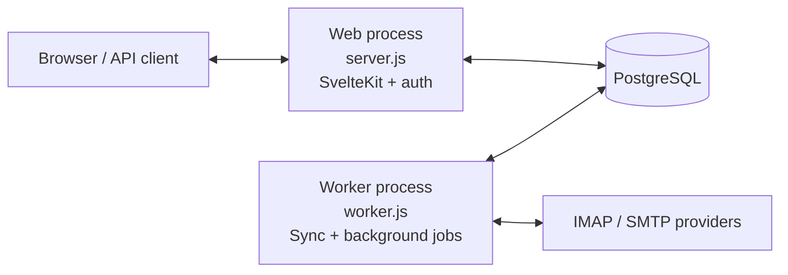

# Architecture

mail is an SSR-first SvelteKit application with a separate background worker. Business logic is
shared between both entry points rather than implemented in either process.

## Runtime topology

The processes can run on different hosts as long as they share PostgreSQL, compatible environment
configuration, and any filesystem storage that must be shared.

## Web process

`server.js` starts the adapter-node handler and adds the WebSocket transport for MCP. Every SvelteKit
request passes through `src/hooks.server.ts`, which:

- Waits for startup migrations and warm-up work.
- Routes Better Auth requests and resolves the owner session.
- Protects authenticated pages and validates external API keys.
- Applies API rate limits.
- Keeps setup, shared links, attachments, tracking pixels, and API documentation public where
  required.
- Records request timing without logging capability tokens.

The web process stores UI changes and enqueues IMAP or SMTP work in PostgreSQL. It does not perform
long-running mail operations in request handlers.

## Worker process

`src/worker.ts` is a standalone polling loop. It:

- Maintains IMAP watcher and worker connections.
- Synchronizes changed mailboxes and repairs interrupted jobs.
- Dispatches queued IMAP and SMTP operations.
- Runs cleanup rules and public-attachment cleanup.
- Performs mail-authentication and OpenPGP backfills.
- Classifies pending messages for importance when AI classification is enabled.
- Delivers email-read and push notifications.
- Optionally exposes the public IMAP proxy.

The worker writes a heartbeat that is visible to the application. A healthy web process without a
worker can render stored mail, but new mail, queued sends, and background automation will stall.

## Data and configuration

PostgreSQL is the source of truth for synchronized mail, thread metadata, authentication, settings,
job queues, and audit data. Drizzle schema definitions live in `src/lib/server/db/`; SQL migrations
live in `drizzle/` and run automatically at process startup.

Configuration saved through setup or Settings is stored in PostgreSQL. The shared loader in
`src/lib/server/config.ts` combines it with environment fallbacks and decrypts protected values with
`MAIL_SECRET_KEY`.

Public-link attachment bytes are streamed to `PUBLIC_ATTACHMENT_DIR`; PostgreSQL stores their
metadata and capability tokens. Other message attachments remain associated with synchronized mail
data and are fetched through the mail storage layer.

## Source layout

| Path                  | Responsibility                                                     |
| --------------------- | ------------------------------------------------------------------ |
| `src/routes/`         | SvelteKit pages and JSON endpoints.                                |
| `src/lib/components/` | Shared Svelte UI components.                                       |
| `src/lib/server/`     | Server-only mail, auth, crypto, automation, and integration logic. |
| `src/lib/server/db/`  | Drizzle schemas, database connection, and migration runner.        |
| `src/worker.ts`       | Worker entry point and dispatch loop.                              |
| `server.js`           | Production web and MCP WebSocket server.                           |
| `drizzle/`            | Generated SQL migrations.                                          |
| `scripts/`            | Development and build orchestration.                               |
